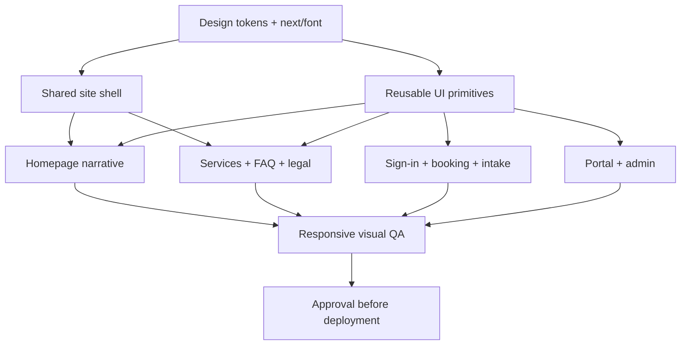
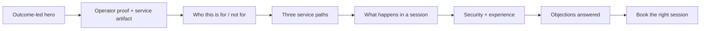

# Hermes Launch Lab Visual Overhaul Plan

> **For Hermes:** Use subagent-driven-development skill to implement this plan task-by-task.

**Goal:** Turn the existing functional consulting site into a premium, unmistakably credible conversion experience that looks deliberately art-directed rather than assembled from generic SaaS parts.

**Architecture:** Keep the current Next.js/App Router business logic, routes, auth, Stripe, Prisma, and booking flow intact. Build a small reusable visual system around a shared site shell, typography/tokens, editorial marketing sections, and consistent application surfaces; validate the result with route-level browser checks and desktop/mobile screenshots.

**Tech Stack:** Next.js 15, React 19, TypeScript, global CSS, `next/font`, Lucide React, Vitest, Playwright

---

## 1. Goal

Preserve the good basis—dark technical tone, clear offer, direct booking path—while replacing the current sparse prototype presentation with a polished consulting brand that can credibly serve as the main sales surface for Hermes Agent services.

**Recommended direction: “Technical atelier.”**

- Dark, precise, editorial, and premium—not cyberpunk, not “AI purple,” not fake-enterprise sterile.
- Keep warm brass/gold as the distinctive accent, but deepen it and use it sparingly.
- Borrow Linear’s luminance hierarchy and typographic precision, Stripe’s conversion clarity and depth, and Apple’s cinematic section pacing without cloning any brand.
- Make the work tangible through a bespoke “session output / system map” visual, process narrative, deliverables, boundaries, and honest proof—not decorative dashboard screenshots or fake logos.

## 2. Done Criteria

- [ ] Homepage has a clear visual narrative: promise → proof → service paths → process → operator credibility → FAQ/objection handling → final CTA.
- [ ] The first viewport immediately communicates who the service is for, what outcome it delivers, and the primary action.
- [ ] No fake customer logos, fabricated testimonials, fake metrics, or meaningless AI imagery.
- [ ] Public routes share a polished header/footer and visual language.
- [ ] Transactional routes (sign-in, booking, intake, success/cancel) feel trustworthy and consistent, not like unstyled utility pages.
- [ ] Portal/admin retain information density while using the same token/component system.
- [ ] Inline style sprawl is removed from touched routes in favor of named, reusable classes/components.
- [ ] Keyboard focus, color contrast, reduced motion, 44px touch targets, and semantic heading order are verified.
- [ ] Layout is intentionally designed at 1440px, 1024px, 768px, 390px, and 360px—not merely allowed to wrap.
- [ ] Existing auth, booking, pricing, Stripe, Prisma, API, and legal behavior remains unchanged.
- [ ] `npm run test`, `npm run typecheck`, `npm run build`, and the corrected lint command all pass.
- [ ] Playwright smoke/visual checks cover critical public and transactional routes.

## 3. Current Context

### Confirmed facts

- Repository: `asimons81/hermes-launch-lab`; branch `master` tracks `origin/master`; worktree was clean during planning.
- Live site: `https://hermes.tonysimons.dev`.
- The current homepage is a 1080px dark container with a thin nav, one headline, two CTAs, three price summaries, and a one-line operator credential. The prior unverified “10+ years shipping production systems” wording is explicitly rejected and must not appear in the redesign.
- The current basis is structurally sound but visually underdeveloped: one flat canvas, weak section rhythm, limited proof, minimal storytelling, no footer, no mobile nav strategy, and little distinction between marketing and application UI.
- The global system is concentrated in `app/globals.css`; most route layout is expressed through inline styles.
- No test files or Playwright config were found. `@playwright/test` and Vitest are installed.
- No project-specific visual overhaul plan or alternate implementation was found in Nexus or Tony’s GitHub account. The current repository is the only prior art and is explicitly the basis to improve, not something to discard.
- `public/` currently contains no assets.

### Visual audit of the live homepage

- **Hierarchy:** The headline is readable, but the hero occupies a small region of a very large empty canvas. The pricing strip competes weakly rather than creating a second scene.
- **Typography:** Functional but generic. The same limited weight/scale vocabulary is used everywhere; muted copy is too dim and narrow for a primary sales message.
- **Layout:** Everything sits on one left edge in one container. There is no composition, counterweight, productized-service artifact, or visual reveal.
- **Trust:** “10+ years” is buried in microcopy. There is no clear process, expected deliverable, security stance, audience fit, or explanation of Tony’s actual operator experience.
- **Conversion:** The CTA exists, but the user has too little context to choose confidently between services. Admin appears in public navigation, which adds noise and makes the site feel like an internal prototype.
- **Brand:** Black + gold is promising, but currently reads as a CSS starter theme rather than a full identity.

## 4. Constraints and Non-Goals

### Constraints

- Free-tier friendly; no paid design service, CMS, analytics product, or asset subscription.
- No changes to live Stripe behavior, database schema, auth policy, pricing semantics, or API contracts in this visual pass.
- No public deployment or publishing without Tony’s explicit approval.
- No invented proof. Claims must be either already true, supplied by Tony, or omitted.
- Preserve the independent-service / no-affiliation disclosure, but move it into a deliberate trust/legal location rather than letting it weaken the hero.
- Use local/self-hosted font delivery through `next/font`; avoid runtime Google Fonts dependency.
- Do not commit automatically; Tony has asked for plan approval, not repository history changes.

### Non-goals

- Calendar integration or real-time availability.
- Reworking the payment funnel or authentication model.
- New customer/admin functionality.
- Full copywriting/SEO campaign beyond the copy needed to make the redesigned experience coherent.
- Theme toggling. The brand should be dark-native and excellent in one mode first.
- Decorative WebGL, video backgrounds, glassmorphism, giant gradients, generic bento spam, or animation for animation’s sake.

## 5. Docs Consulted / Docs Still Needed

### Consulted

- Local source: `app/page.tsx`, `app/globals.css`, `app/layout.tsx`, all primary public/transactional/app route files, and `components/ServiceCard.tsx`.
- Local manifest: `package.json`, `tsconfig.json`; confirmed Next.js/React/Lucide/Playwright/Vitest availability.
- Live homepage visual inspection at `https://hermes.tonysimons.dev`.
- Nexus and GitHub prior-art search for Hermes Launch Lab.
- Local design references: Linear, Stripe, and Apple design-system notes from the `web-design` skill.

### Phase 0 docs/evidence still needed before implementation

1. Inspect the generated Next.js route/build output and confirm the exact lint failure/success mode because `next lint` is obsolete on modern Next.js 15 and the current script may not be valid.
2. Run the existing test/typecheck/build baseline before changing code and record any pre-existing failures.
3. Capture baseline screenshots of `/`, `/services`, `/faq`, and `/auth/signin` at desktop and mobile widths.
4. Confirm any factual operator claims beyond “10+ years shipping production systems,” “Arch Linux,” and “fleet operations” before putting them into prominent copy.
5. Confirm whether “$99–149” on the homepage is intentional; `app/services/page.tsx` currently models the strategy service at `$99`, creating a visible pricing inconsistency.
6. Inspect authenticated route states with safe local fixtures or mocks before designing portal/admin screenshots; do not expose live user data.

## 6. Architecture Overview

Introduce three visual layers without disturbing server behavior:

1. **Foundation:** font loading, semantic tokens, spacing/type scales, focus/motion rules, responsive primitives.
2. **Shared chrome and components:** public header/footer, wordmark, buttons, section wrappers, labels, cards, notices, form fields, empty states.
3. **Route composition:** a rich marketing homepage; focused service and FAQ pages; trustworthy booking/auth/intake states; restrained portal/admin application UI.

Marketing pages should be expressive. Transactional pages should be calm. Portal/admin should be dense and operational. They share DNA, not identical layouts.

## 7. Mermaid Diagram

### Homepage narrative

## 8. File Map

### Create

- `components/SiteHeader.tsx` — public shell, desktop/mobile navigation, primary booking action.
- `components/SiteFooter.tsx` — service/legal/independence links and concise operator identity.
- `components/BrandMark.tsx` — text/SVG wordmark treatment; no image dependency.
- `components/ButtonLink.tsx` — primary, secondary, and text-link variants.
- `components/Section.tsx` — width, spacing, eyebrow, and section-heading composition.
- `components/ProcessRail.tsx` — three/four-step engagement process.
- `components/SystemMap.tsx` — bespoke CSS/SVG “first useful workflow” visual for the hero/proof area.
- `components/TrustPanel.tsx` — security boundaries, operator credibility, independent-service disclosure.
- `components/Notice.tsx` — warning/success/info treatment for intake and transactional states.
- `tests/ui/homepage.test.tsx` — semantic/content/component contract tests if React DOM test support is available; otherwise keep behavior checks in Playwright.
- `tests/e2e/public-routes.spec.ts` — public route navigation and responsive smoke checks.
- `tests/e2e/transactional-routes.spec.ts` — sign-in and safe unauthenticated redirects.
- `playwright.config.ts` — local Next.js web server and desktop/mobile projects.

### Modify

- `app/layout.tsx` — `next/font`, metadata polish, shared body treatment.
- `app/globals.css` — full token system, reset, utilities, shared components, responsive and reduced-motion rules.
- `app/page.tsx` — rebuild homepage narrative and composition.
- `app/services/page.tsx` — service comparison, inclusions, fit guidance, stronger CTA hierarchy.
- `components/ServiceCard.tsx` — typed props, featured tier state, inclusions, accessible link/button hierarchy.
- `app/faq/page.tsx` — structured FAQ/objection page using semantic disclosure or well-spaced question groups.
- `app/auth/signin/page.tsx` — premium focused authentication card with trust copy.
- `app/book/page.tsx` — clear step framing, selected service summary, trustworthy form composition.
- `app/book/success/page.tsx` and `app/book/cancel/page.tsx` — polished status states with next actions.
- `app/intake/page.tsx` — grouped form sections, proper checkbox layout, prominent secret warning.
- `app/portal/page.tsx` — consistent app shell, empty states, clear next action.
- `app/admin/page.tsx` — responsive table shell/status treatment without changing authorization or data access.
- `app/legal/layout.tsx` and legal pages — readable prose measure, consistent navigation/footer, draft notices.
- `package.json` — correct lint command and deterministic Playwright scripts if required.

### Explicitly untouched unless a regression forces a narrow fix

- `app/api/**`
- `lib/auth.ts`, `lib/email.ts`, `lib/db.ts`
- `prisma/**`
- Stripe webhook and booking business logic

## 9. Data / API / Schema Impact

- **Database:** none.
- **API routes:** none.
- **Auth/session contract:** none.
- **Stripe contract:** none.
- **Service model:** no schema change. UI gets a narrow TypeScript interface derived from fields already rendered: `slug`, `name`, `price`, `durationMin`, and `description`.
- **Content:** homepage/service copy expands, but prices and deliverables must remain sourced from confirmed product definitions. Resolve the `$99–149` vs `$99` inconsistency before final copy.
- **Assets:** prefer CSS, inline SVG, and Lucide icons. Any generated raster imagery requires a separate brief and QA; it is not required for the recommended direction.

## 10. Implementation Phases

### Phase 0 — Establish evidence and lock the art direction

#### Task 0.1: Record baseline quality gates

**Files:** Read only.

1. Run `npm run test -- --run`; expected: current suite result recorded, likely zero tests rather than a false “covered” claim.
2. Run `npm run typecheck`; expected: pass or exact pre-existing diagnostics recorded.
3. Run `npm run lint`; expected: determine whether `next lint` is currently invalid.
4. Run `npm run build`; expected: production build completes or blocker is documented.
5. Do not modify product code until baseline is known.

#### Task 0.2: Capture baseline route screenshots

**Files:** Create only implementation evidence under `.hermes/plans/<overhaul-evidence>/` or a temporary ignored directory.

1. Capture `/`, `/services`, `/faq`, and `/auth/signin` at 1440×900 and 390×844.
2. Record visible overflow, tiny touch targets, dim text, and route inconsistency.
3. Keep these as before/after comparison evidence; do not commit unless Tony asks.

#### Task 0.3: Produce three disposable hero-direction sketches

**Files:** Create temporary self-contained HTML sketches under `.hermes/plans/hermes-launch-lab-overhaul/`.

1. Build **A: Precision Atelier**—recommended, dark technical editorial, brass accent, bespoke system map.
2. Build **B: Cinematic Operator**—larger type, stronger full-width scene changes, minimal chrome.
3. Build **C: Technical Field Manual**—more structured, grid/annotation-led, restrained industrial character.
4. Use the real offer/copy, not lorem ipsum.
5. Render each at desktop and mobile.
6. Present a comparison and obtain Tony’s direction approval before production implementation.

**Expected decision:** A as the base, with selected drama from B. C is the divergent control, not the default.

#### Task 0.4: Resolve factual/copy gaps

1. Confirm strategy pricing display.
2. Confirm which operator credentials may be prominent.
3. Confirm whether custom builds should lead to booking or application language.
4. Record decisions in this plan’s §13 decision log before implementation.

### Phase 1 — Build the visual foundation

#### Task 1.1: Add font and metadata foundation

**Files:** Modify `app/layout.tsx`.

1. Add a local `next/font` sans/mono pairing using available Next.js-managed font support.
2. Expose font variables on `<body>` or `<html>`.
3. Preserve existing title/description meaning; improve metadata wording only if factual.
4. Run `npm run typecheck`; expected: pass.
5. Run `npm run build`; expected: layout/font compilation succeeds.

#### Task 1.2: Replace starter CSS with semantic tokens

**Files:** Modify `app/globals.css`.

1. Define background/surface/text/border/accent/status tokens with WCAG-safe values.
2. Define fluid type with `clamp()`, a disciplined spacing scale, max-widths, radii, and motion durations.
3. Add focus-visible, selection, reduced-motion, and base form behavior.
4. Add layout primitives for wide/standard/narrow content and section pacing.
5. Do not add route-specific hacks yet.
6. Run typecheck/build; expected: pass with no visual overflow on the current pages.

#### Task 1.3: Add shared primitive components

**Files:** Create `components/BrandMark.tsx`, `ButtonLink.tsx`, `Section.tsx`, `Notice.tsx`.

1. Define narrow typed props before route conversion.
2. Keep components server-compatible unless interaction requires a client boundary.
3. Ensure button/link variants preserve semantic element choice.
4. Add component/route contract test first where the existing test environment supports JSX; otherwise add Playwright assertions before production route conversion.
5. Run the specific test to verify RED, implement minimally, then verify GREEN.

### Phase 2 — Build the shared shell

#### Task 2.1: Create the public header

**Files:** Create `components/SiteHeader.tsx`; modify `app/globals.css`.

1. Write a failing Playwright assertion for brand link, public nav, booking CTA, and mobile menu accessibility.
2. Implement desktop navigation: Services, Process/FAQ, Client portal, and primary Book CTA.
3. Remove Admin from public navigation.
4. Implement a simple accessible mobile disclosure/menu without a heavy dependency.
5. Verify 44px targets and keyboard operation.

#### Task 2.2: Create the site footer

**Files:** Create `components/SiteFooter.tsx`; modify `app/globals.css`.

1. Add services, FAQ, portal, privacy, terms, and refund links.
2. Include the independent-service disclosure in readable—not microscopic—type.
3. Include a concise Tony/operator signature without unverified claims.
4. Verify links and responsive stacking in Playwright.

### Phase 3 — Rebuild the homepage as the flagship sales surface

#### Task 3.1: Build the outcome-led hero

**Files:** Modify `app/page.tsx`; create `components/SystemMap.tsx`.

1. Write failing tests/assertions for one H1, primary CTA, secondary CTA, and visible offer statement.
2. Replace “Private consulting for Hermes Agent” as the sole message with an outcome-first headline and specific supporting copy.
3. Create an asymmetric two-column desktop composition: editorial copy plus a bespoke “system map / session output” artifact.
4. Keep motion subtle: staged reveal/trace only when motion is allowed.
5. Ensure the hero collapses to a clean single-column mobile composition.

#### Task 3.2: Add credible proof without bullshit

**Files:** Modify `app/page.tsx`; create `components/TrustPanel.tsx`.

1. Add an operator proof strip using only confirmed experience.
2. Explain the security boundary: never send secrets; customer controls accounts/keys; independent service.
3. Show tangible session outputs rather than fake outcome numbers.
4. Verify all claims against §5 evidence.

#### Task 3.3: Add audience fit and service choice

**Files:** Modify `app/page.tsx`, `components/ServiceCard.tsx`.

1. Add “best for / not for” guidance so visitors self-qualify.
2. Present three service paths with the Launch Session as the recommended middle option only if product strategy confirms it.
3. Add concrete inclusions and clear action labels.
4. Resolve pricing consistency before rendering.
5. Test links preserve the expected `?service=` query.

#### Task 3.4: Add process, FAQ preview, and final CTA

**Files:** Create `components/ProcessRail.tsx`; modify `app/page.tsx`.

1. Explain the flow: choose → prepare safely → work live → leave with tested outcome/follow-up.
2. Add a compact objection/FAQ preview with a link to the full FAQ.
3. End with a high-contrast CTA scene that repeats the right action, not the entire offer.
4. Add the shared footer.
5. Verify heading order and tab order.

### Phase 4 — Bring public supporting pages up to flagship quality

#### Task 4.1: Redesign services comparison

**Files:** Modify `app/services/page.tsx`, `components/ServiceCard.tsx`.

1. Write route assertions for all service names, prices, durations, and booking links.
2. Add clear inclusions, ideal-customer language, and differentiation.
3. Avoid identical generic cards; use one featured tier and restrained comparison rows.
4. Preserve the independent-service disclosure and USD note.
5. Verify 3→1 column behavior without horizontal overflow.

#### Task 4.2: Redesign FAQ and legal reading surfaces

**Files:** Modify `app/faq/page.tsx`, `app/legal/layout.tsx`, and legal pages only where presentation requires classes.

1. Use a narrow readable measure and strong question hierarchy.
2. Add shared shell/footer to FAQ and legal layout.
3. Style draft/legal-review notices honestly.
4. Do not alter legal meaning during a visual task.
5. Verify all legal routes return 200 and retain their full text.

### Phase 5 — Redesign transactional flows for trust

#### Task 5.1: Redesign sign-in

**Files:** Modify `app/auth/signin/page.tsx`.

1. Write a failing route assertion for email input, submit action, and no-password explanation.
2. Add focused shell, restrained trust panel, explicit magic-link expectation, and accessible labels.
3. Preserve the existing server action and redirect behavior.
4. Verify keyboard-only completion.

#### Task 5.2: Redesign booking

**Files:** Modify `app/book/page.tsx`.

1. Preserve auth guard and database query exactly.
2. Add a clear booking step title, selected-service summary, and checkout expectation.
3. Replace “Development fixtures only” with an intentional non-production notice until real availability exists; do not disguise the limitation.
4. Verify service selection and datetime submission fields remain named correctly.

#### Task 5.3: Redesign intake and completion states

**Files:** Modify `app/intake/page.tsx`, `app/book/success/page.tsx`, `app/book/cancel/page.tsx`.

1. Group intake fields semantically with `fieldset`/`legend` where appropriate.
2. Correct checkbox sizing/layout so global input width does not distort it.
3. Promote the no-secrets warning with `Notice`.
4. Give success/cancel states clear status iconography and next actions.
5. Preserve all form names and endpoints.

### Phase 6 — Apply the system to portal/admin

#### Task 6.1: Redesign portal empty states

**Files:** Modify `app/portal/page.tsx`.

1. Preserve auth redirect and sign-out form.
2. Add compact app-shell navigation distinct from public marketing chrome.
3. Turn blank cards into deliberate empty states with next actions.
4. Verify unauthenticated redirect and authenticated layout separately.

#### Task 6.2: Redesign admin table safely

**Files:** Modify `app/admin/page.tsx`.

1. Preserve server-side role check and query.
2. Add responsive overflow container, status badges, tabular numerals, and empty-table state.
3. Do not expose additional customer data.
4. Verify at 390px that the page scrolls the table region—not the whole viewport horizontally.

### Phase 7 — Automation and final visual QA

#### Task 7.1: Establish deterministic test scripts

**Files:** Create `playwright.config.ts`, test specs; modify `package.json`.

1. Correct lint command based on Phase 0 evidence, likely ESLint CLI rather than `next lint`.
2. Add non-watch test scripts suitable for CI/local verification.
3. Configure Playwright web server without touching production services.
4. Write public-route and transactional-safe smoke tests first, confirm RED, then make routes pass.

#### Task 7.2: Run breakpoint and accessibility review

1. Capture after screenshots at 1440×900, 1024×768, 768×1024, 390×844, and 360×800.
2. Compare against Phase 0 evidence.
3. Test keyboard nav, visible focus, heading order, labels, touch targets, contrast, reduced motion, and 200% zoom.
4. Fix only verified issues; avoid subjective churn after the approved direction is met.

#### Task 7.3: Run the complete gate

Run in this order:

1. `npm run test -- --run` — expected: all tests pass and process exits.
2. `npm run lint` — expected: zero ESLint errors.
3. `npm run typecheck` — expected: zero TypeScript errors.
4. `npm run build` — expected: production build succeeds and all intended routes compile.
5. `npm run test:e2e` — expected: desktop/mobile route suite passes.
6. Manually inspect screenshot diffs; expected: no clipping, overflow, unreadable type, accidental route regressions, or generic placeholder content.

#### Task 7.4: Approval before deployment

1. Present desktop/mobile screenshots and the quality-gate output.
2. List any copy claims still awaiting confirmation.
3. Ask Tony for explicit approval before commit, push, or Vercel deployment.

## 11. Verification Plan

| Surface | Proof | Expected outcome |
|---|---|---|
| Homepage | Playwright + screenshots | One H1, clear CTAs, narrative sections, no overflow |
| Services | Content/link assertions | Correct prices/durations and booking query links |
| Header/footer | Keyboard + route assertions | All public links reachable; Admin absent from public nav |
| Sign-in | DOM/keyboard check | Labeled email field, server action intact, clear magic-link copy |
| Booking | Auth-safe test | Guard preserved; fields retain exact names and action |
| Intake | DOM/accessibility check | No-secrets warning prominent; checkbox renders correctly |
| Portal/admin | Redirect + authenticated fixture check | Authorization preserved; responsive application layout |
| Legal | Route smoke tests | Text unchanged; readable layout and disclosure retained |
| Responsive | Five viewport screenshots | Intentional compositions, no accidental wrapping/overflow |
| Accessibility | Keyboard, focus, contrast, reduced motion, zoom | WCAG AA-oriented behavior on critical paths |
| Build | Test/lint/typecheck/build/e2e | All commands exit 0 |

## 12. Risk Table

| Risk | Likelihood | Impact | Mitigation |
|---|---:|---:|---|
| Redesign becomes “dark Linear clone” | Medium | High | Use Linear only for precision; retain brass identity and bespoke operator/system-map composition |
| More content creates generic SaaS bloat | Medium | High | Every section must answer a buying objection or prove an outcome; delete decorative filler |
| Unverified claims undermine trust | Medium | High | Claim ledger in Phase 0; no logos/testimonials/metrics without evidence |
| Pricing inconsistency persists | High | High | Resolve `$99–149` vs `$99` before production copy |
| Visual refactor breaks forms/auth | Medium | High | Preserve names/actions/guards; route-level regression assertions before edits |
| Global CSS causes app-route regressions | Medium | Medium | Semantic tokens and component classes; test marketing and app surfaces separately |
| Mobile menu adds unnecessary client complexity | Low | Medium | Native disclosure or minimal isolated client component; no menu library |
| Animation hurts performance/accessibility | Low | Medium | CSS-first, transform/opacity only, reduced-motion path, no animation dependency |
| Font loading creates layout shift | Low | Medium | `next/font` local optimization and fallback metrics |
| Existing lint script is broken | High | Low | Fix only after baseline confirms actual Next.js 15 behavior |
| Screenshot tests become brittle | Medium | Medium | Use visual checks for major compositions; DOM assertions for behavior/content |
| Scope expands into backend/product repair | Medium | High | Explicitly leave APIs/schema/payment/auth logic untouched in this pass |

## 13. Open Questions — Resolved 2026-07-28

1. **Truthful proof only:** The prior “10+ years shipping systems” language is rejected. The redesign will not make tenure, deployment-count, customer, or outcome claims without direct evidence. It will use concrete, verifiable service scope and security boundaries instead (see §§2, 3, 10 Tasks 3.2 and 3.3).
2. **Art direction:** Tony approved the Technical Atelier direction and granted approval to implement, publish, and verify it. The initial three-sketch gate is superseded; build the approved concept directly (see §§1, 6, 7, and 10).
3. **Mobile quality:** Mobile-friendly behavior is a release requirement, with intentional 390px and 360px compositions plus Playwright/screenshot verification (see §§2, 10 Task 7.2, and 11).
4. **Pricing:** Keep existing product data as the source of truth. Do not alter price semantics in the visual overhaul; flag the homepage `$99–149` / service `$99` inconsistency only if it cannot be represented honestly without a decision (see §§5 and 9).
5. **Custom-build action:** Preserve the existing booking route and “application required” language rather than silently changing the sales workflow (see §10 Task 3.3).

### Decision log

- **2026-07-28 — rejected unverified credential:** Tony explicitly directed that the “10+ years shipping systems” claim is false and must not be presented. Removed from planned proof language and prohibited in implementation. 
- **2026-07-28 — approved execution and publishing:** Tony approved the Technical Atelier concept, requested mobile friendliness, and granted permission to publish after verification.

## 14. Approval Gate

Approval of this plan authorizes **local design exploration and implementation only**. It does not authorize committing, pushing, deploying, publishing, changing pricing, changing legal text, changing Stripe/auth/data behavior, or adding unverified claims.

**Recommended approval:** Proceed with Phase 0, produce the three visual directions, and treat **Technical Atelier** as the favored base. Stop for Tony’s visual selection before touching production UI files.

## 15. Fresh-Session Pickup

1. Read this plan in full.
2. Re-check `git status --short --branch`; stop if unrelated changes exist.
3. Re-run the Phase 0 baseline commands—do not trust this planning snapshot as current state.
4. Resolve §13 questions by patching this plan’s decision log and all affected sections.
5. Load `web-design`, `test-driven-development`, and `subagent-driven-development` skills.
6. Produce the three disposable sketches under `.hermes/plans/` only.
7. Get Tony’s visual-direction approval.
8. Implement task-by-task using vertical RED→GREEN slices.
9. Do not commit, push, or deploy unless Tony explicitly authorizes it after reviewing screenshots and verification output.
